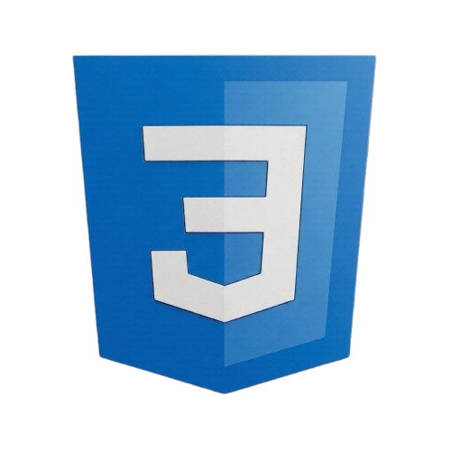

# Fotogram

A small photo gallery website — my first project involving JavaScript, built for learning purposes.

---

## About

Fotogram lets you browse a collection of photos as thumbnails and open them in a dialog for a closer look. The project was a hands-on introduction to JavaScript. The entire site is navigable by keyboard and follows WCAG guidelines.

---

## Features

**Thumbnail gallery**
**Photo dialog**
**Full keyboard navigation**
**WCAG accessibility**
**Responsive design**
**Optimized assets**

---

## Built With

---

## Getting Started

No setup or installation required.

1. Clone or download the repository
2. Open `index.html` in your browser

That's it.

---

## License

This project has no license. It was created for personal learning and educational purposes.